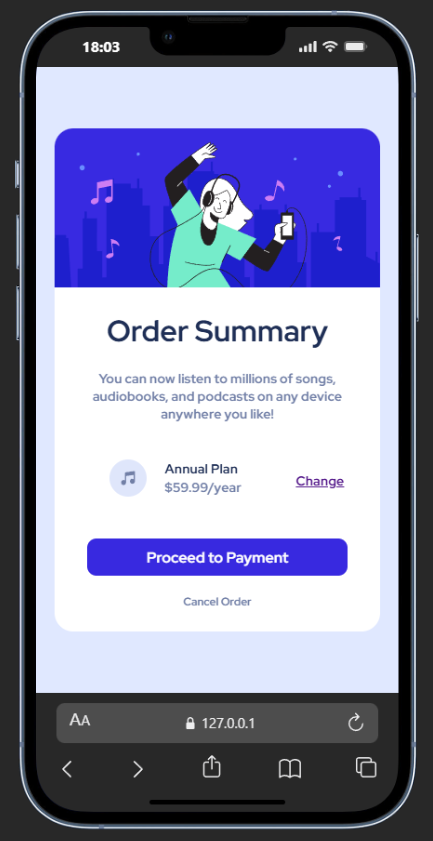

# Frontend Mentor - Order summary card solution

Esta é uma solução para o [desafio Order summary card no Frontend Mentor](https://www.frontendmentor.io/challenges/order-summary-component-QlPmajDUj).

- Link da Solução: [GitHub Pages](https://mmdros.github.io/Order-summary-component-frontend-challenge/)

## Sumário

- [Visão Geral](#visão-geral)
  - [O desafio](#o-desafio)
  - [Screenshot](#screenshot)
- [Meu processo](#meu-processo)
  - [Tecnologias utilizadas](#tecnologias-utilizadas)
  - [O que aprendi](#o-que-aprendi)
  - [Funcionalidade Extra: i18n.js](#funcionalidade-extra-i18njs)
- [Como executar](#como-executar)

## Visão Geral

### O desafio

Os usuários devem ser capazes de:

- Visualizar o layout ideal para o componente, dependendo do tamanho da tela do dispositivo.
- Ver estados de hover para todos os elementos interativos na página.
- **Bônus:** Alternar entre os idiomas Português e Inglês.

### Screenshot

#### Desktop

#### Mobile

## Meu processo

### Tecnologias utilizadas

- HTML5 Semântico
- CSS Custom Properties (Variáveis)
- Flexbox
- Mobile-first workflow
- JavaScript (ES6+) para lógica de internacionalização
- Fetch API para carregamento de JSON

### O que aprendi

Neste projeto, pude aprofundar meus conhecimentos em:

1.  **Organização de CSS:** Dividi o CSS em arquivos específicos (`variables.css`, `reset.css`, `card.css`, `container.css` e `media.css`) para manter o código modular e fácil de manter.
2.  **Manipulação Assíncrona:** Pratiquei o uso de `async/await` para carregar recursos externos (arquivos de tradução) sem bloquear a renderização da página.
3.  **Persistência de Dados:** Aprendi a utilizar o `localStorage` para salvar a preferência de idioma do usuário.

### Funcionalidade Extra: i18n.js

Diferente do projeto original proposto pelo Frontend Mentor, adicionei um sistema de internacionalização (i18n) personalizado:

-   **Dinamicidade:** O conteúdo da página é atualizado instantaneamente sem a necessidade de recarregar o navegador.
-   **Atributos Data:** Utilizei atributos `data-i18n` no HTML para mapear quais elementos devem ser traduzidos, mantendo o HTML limpo e separando o conteúdo da estrutura.
-   **Fallback:** O script está preparado para lidar com chaves ausentes e erros de carregamento, garantindo a resiliência da interface.

## Como executar

Basta abrir o arquivo `index.html` em qualquer navegador moderno ou utilizar uma extensão como o "Live Server" no VS Code para visualizar o projeto em funcionamento.
